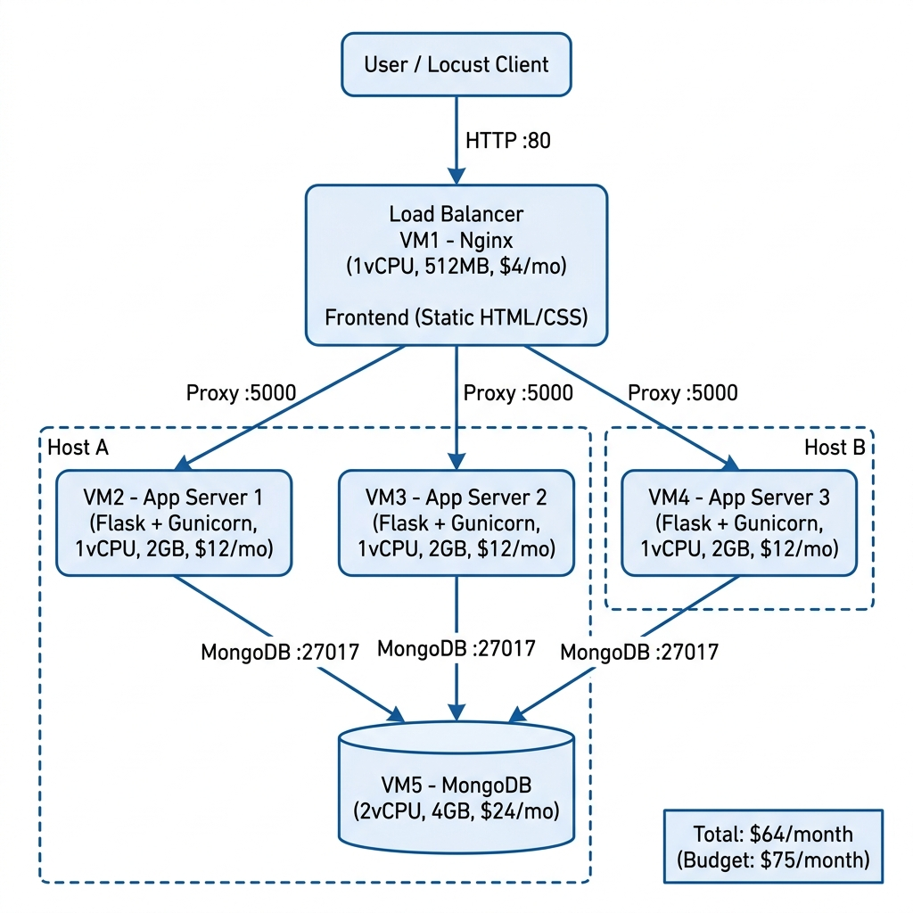

# Final Project Teknologi Komputasi Awan - Kelompok B-05

## Anggota Kelompok

| No | Nama | NRP |
|:---:|---|---|
| 1 | Nabilah Anindya Paramesti | 5027241006 |
| 2 | Mochkamad Maulana Syafaat | 5027241021 |
| 3 | Zein Muhammad Hasan | 5027241035 |
| 4 | Khumaidi Kharis Az-zacky | 5027241049 |
| 5 | Dimas Muhammad Putra | 5027241076 |
| 6 | Jofanka Al-kautsar Pangestu Abady | 5027241107 |
| 7 | Naufal Ardhana | 5027241118 |

---

## 1. Introduction

Proyek ini merupakan Final Project mata kuliah Teknologi Komputasi Awan yang bertujuan untuk merancang, mengimplementasikan, dan mengoptimalkan **Order Processing Service** -- sebuah layanan backend berbasis REST API untuk platform e-commerce. Layanan ini menangani pembuatan pesanan, pengecekan status, dan riwayat transaksi.

Tantangan utama yang dihadapi adalah men-deploy layanan ini pada infrastruktur cloud dengan **budget maksimal 75 US$/bulan** sambil memaksimalkan kemampuan sistem dalam menangani traffic tinggi (diukur melalui RPS - Request Per Second).

Teknologi yang digunakan:
- **Backend**: Python Flask + Gunicorn (gevent worker)
- **Database**: MongoDB
- **Load Balancer**: Nginx (least_conn)
- **Load Testing**: Locust
- **Deployment**: Local Virtual Machine (VirtualBox/Vagrant)

---

## 2. Arsitektur Cloud

### 2.1 Diagram Arsitektur

<!-- Ganti path berikut dengan gambar diagram dari draw.io -->


### 2.2 Tabel Spesifikasi dan Harga

| No | VM | Peran | Tipe | CPU | RAM | Harga/bulan | Host |
|----|------|-------|------|-----|-----|-------------|------|
| 1 | VM1 | Load Balancer (Nginx) + Frontend | vm1 | 1 vCPU | 512 MB | $4 | Komputer A |
| 2 | VM2 | App Server 1 (Flask + Gunicorn) | vm3 | 1 vCPU | 2 GB | $12 | Komputer A |
| 3 | VM3 | App Server 2 (Flask + Gunicorn) | vm3 | 1 vCPU | 2 GB | $12 | Komputer B |
| 4 | VM4 | App Server 3 (Flask + Gunicorn) | vm3 | 1 vCPU | 2 GB | $12 | Komputer B |
| 5 | VM5 | Database Server (MongoDB) | vm5 | 2 vCPU | 4 GB | $24 | Komputer A |
| | | | **TOTAL** | | | **$64** | |

Budget terpakai: $64 dari $75 (sisa $11).

### 2.3 Justifikasi Arsitektur

**Pemisahan Database dari App Server**
MongoDB ditempatkan di VM terpisah dengan spesifikasi tertinggi (vm5, 2vCPU, 4GB) karena database merupakan bottleneck utama pada operasi I/O. Dengan RAM 4GB, WiredTiger cache engine MongoDB mendapat alokasi ~2GB yang cukup untuk menampung working set dari 10.000+ orders.

**3 App Server dengan Horizontal Scaling**
Menggunakan 3 instance app server (vm3, 2GB masing-masing) dibanding 1 instance besar karena:
- Horizontal scaling memberikan fault tolerance (jika 1 VM mati, 2 lainnya tetap melayani)
- Setiap VM menjalankan 3 Gunicorn workers dengan gevent (async I/O) sehingga total ada 9 workers
- Beban request terdistribusi merata melalui load balancer

**Nginx sebagai Load Balancer**
Nginx dipilih karena ringan (hanya butuh 512MB) dan mendukung berbagai strategi distribusi traffic. Menggunakan `least_conn` agar request diarahkan ke server dengan koneksi aktif paling sedikit, optimal untuk workload dengan response time bervariasi.

**Gunicorn dengan Gevent Worker**
Dibandingkan sync worker standar, gevent worker memungkinkan setiap worker menangani ratusan request secara concurrent melalui coroutine. Ini sangat efektif untuk I/O-bound workload (menunggu response MongoDB).

---

## 3. Implementasi

### 3.1 Setup MongoDB (VM5)

<!-- Screenshot terminal saat instalasi dan konfigurasi MongoDB -->
<!--  -->

Langkah-langkah:

1. **Install MongoDB 7.0** pada Ubuntu 22.04
2. **Konfigurasi** `bindIp: 0.0.0.0` agar dapat diakses dari app server
3. **Restore data awal** menggunakan `mongorestore --drop dump/`
4. **Buat index** untuk optimasi query:
   - `orders.order_id` - lookup by order ID
   - `orders.user_id + created_at` - list orders per user
   - `orders.status` - filter by status
   - `orders.created_at` - sort by date
   - `products.category + is_active` - filter produk
   - `users.email` (unique) - login lookup

```bash
# Contoh pembuatan index
mongosh orderdb --eval '
  db.orders.createIndex({order_id: 1});
  db.orders.createIndex({user_id: 1, created_at: -1});
  db.orders.createIndex({status: 1});
  db.orders.createIndex({created_at: -1});
  db.products.createIndex({category: 1, is_active: 1});
  db.users.createIndex({email: 1}, {unique: true});
'
```

### 3.2 Deploy Backend - App Server (VM2, VM3, VM4)

<!-- Screenshot terminal saat deploy backend -->
<!--  -->

Langkah-langkah (diulang di setiap app server):

1. **Install Python 3, pip, virtualenv**
2. **Copy source code** `app.py` dan `requirements.txt`
3. **Install dependencies** + `gevent` untuk async worker
4. **Konfigurasi environment variables**:
   - `MONGO_URI=mongodb://<IP_VM5>:27017/`
   - `JWT_SECRET=<secret-key>`
5. **Buat systemd service** untuk Gunicorn:
   ```
   gunicorn -w 3 -k gevent -b 0.0.0.0:5000 app:app --timeout 120
   ```
6. **Verifikasi** dengan `curl http://localhost:5000/health`

### 3.3 Setup Nginx Load Balancer (VM1)

<!-- Screenshot konfigurasi Nginx -->
<!--  -->

Konfigurasi utama:
```nginx
upstream flask_backend {
    least_conn;
    server <IP_VM2>:5000;
    server <IP_VM3>:5000;
    server <IP_VM4>:5000;
    keepalive 64;
}
```

Frontend (static files) di-serve langsung oleh Nginx dari `/var/www/frontend/`.
Semua request API (`/auth/`, `/products`, `/orders`, `/admin/`, `/health`) di-proxy ke upstream backend.

### 3.4 Deploy Frontend (VM1)

<!-- Screenshot frontend yang berjalan -->
<!--  -->

Frontend berupa file HTML + CSS statis yang sudah disesuaikan dengan backend API:
- Halaman login/registrasi dengan JWT authentication
- Katalog produk dengan filter dan sorting
- Pembuatan pesanan dengan sistem keranjang
- Daftar dan detail pesanan
- Admin panel (statistik, update status, manajemen user)

---

## 4. Hasil Pengujian Endpoint

Pengujian dilakukan menggunakan Postman terhadap semua endpoint yang tersedia.

### 4.1 Auth Endpoints

| No | Endpoint | Method | Status | Screenshot |
|----|----------|--------|--------|------------|
| 1 | `/auth/register` | POST | 201 Created |  |
| 2 | `/auth/login` | POST | 200 OK |  |
| 3 | `/auth/me` | GET | 200 OK |  |

### 4.2 Product Endpoints

| No | Endpoint | Method | Status | Screenshot |
|----|----------|--------|--------|------------|
| 4 | `/products` | GET | 200 OK |  |
| 5 | `/products/<id>` | GET | 200 OK |  |

### 4.3 Order Endpoints

| No | Endpoint | Method | Status | Screenshot |
|----|----------|--------|--------|------------|
| 6 | `/orders` | POST | 201 Created |  |
| 7 | `/orders` | GET | 200 OK |  |
| 8 | `/orders/<order_id>` | GET | 200 OK |  |
| 9 | `/orders/<order_id>/status` | PUT | 200 OK |  |

### 4.4 Admin Endpoints

| No | Endpoint | Method | Status | Screenshot |
|----|----------|--------|--------|------------|
| 10 | `/admin/stats` | GET | 200 OK |  |
| 11 | `/admin/users` | GET | 200 OK |  |
| 12 | `/health` | GET | 200 OK |  |

### 4.5 Tampilan Frontend

<!-- Ganti dengan screenshot frontend yang sudah berjalan -->
<!--  -->
<!--  -->
<!--  -->

---

## 5. Hasil Load Testing

Load testing dilakukan menggunakan Locust dari host yang berbeda dari server aplikasi.

**Konfigurasi Locust:**
- File: `locustfile.py` (disediakan)
- Host target: `http://<IP_LOAD_BALANCER>`
- User types: CustomerUser (80%) + AdminUser (20%)

**Catatan:** Database orders yang di-insert selama testing dihapus sebelum setiap skenario baru. Data awal (dump) tidak dihapus.

### 5.1 Skenario 1: Maksimum RPS (0% Failure)

- **Metode:** Naikkan jumlah user secara bertahap hingga ditemukan RPS tertinggi tanpa failure
- **Durasi:** 60 detik
- **Hasil:**

| Metrik | Nilai |
|--------|-------|
| Jumlah User | [ISI] |
| Spawn Rate | [ISI] |
| Rata-rata RPS | **[ISI]** |
| Failure Rate | 0% |
| Avg Response Time | [ISI] ms |

<!-- Screenshot grafik Locust -->
<!--  -->

<!-- Screenshot resource utilization -->
<!--  -->

### 5.2 Skenario 2: Peak Concurrency - Spawn Rate 50

- **Durasi:** 60 detik
- **Spawn Rate:** 50
- **Hasil:**

| Metrik | Nilai |
|--------|-------|
| Max Concurrent Users (0% fail) | **[ISI]** |
| Rata-rata RPS | [ISI] |
| Avg Response Time | [ISI] ms |

<!--  -->

### 5.3 Skenario 3: Peak Concurrency - Spawn Rate 100

- **Durasi:** 60 detik
- **Spawn Rate:** 100
- **Hasil:**

| Metrik | Nilai |
|--------|-------|
| Max Concurrent Users (0% fail) | **[ISI]** |
| Rata-rata RPS | [ISI] |
| Avg Response Time | [ISI] ms |

<!--  -->

### 5.4 Skenario 4: Peak Concurrency - Spawn Rate 200

- **Durasi:** 60 detik
- **Spawn Rate:** 200
- **Hasil:**

| Metrik | Nilai |
|--------|-------|
| Max Concurrent Users (0% fail) | **[ISI]** |
| Rata-rata RPS | [ISI] |
| Avg Response Time | [ISI] ms |

<!--  -->

### 5.5 Skenario 5: Peak Concurrency - Spawn Rate 500

- **Durasi:** 60 detik
- **Spawn Rate:** 500
- **Hasil:**

| Metrik | Nilai |
|--------|-------|
| Max Concurrent Users (0% fail) | **[ISI]** |
| Rata-rata RPS | [ISI] |
| Avg Response Time | [ISI] ms |

<!--  -->

### 5.6 Ringkasan Hasil Load Testing

| Skenario | Spawn Rate | Max Users (0% fail) | Avg RPS | Avg Response Time |
|----------|------------|---------------------|---------|-------------------|
| 1 - Max RPS | bertahap | [ISI] | **[ISI]** | [ISI] ms |
| 2 - Peak Concurrency | 50 | [ISI] | [ISI] | [ISI] ms |
| 3 - Peak Concurrency | 100 | [ISI] | [ISI] | [ISI] ms |
| 4 - Peak Concurrency | 200 | [ISI] | [ISI] | [ISI] ms |
| 5 - Peak Concurrency | 500 | [ISI] | [ISI] | [ISI] ms |

---

## 6. Kesimpulan dan Saran

### 6.1 Kesimpulan

[Tuliskan analisis terhadap hasil pengujian. Contoh:]

- Arsitektur dengan 3 app server + 1 load balancer + 1 database server mampu mencapai rata-rata RPS sebesar **[ISI]** dengan 0% failure rate
- Bottleneck utama terletak pada [database I/O / CPU app server / network bandwidth]
- Spawn rate yang lebih tinggi menyebabkan penurunan jumlah concurrent user yang dapat ditangani karena [alasan]
- Penggunaan gevent worker pada Gunicorn terbukti [efektif/kurang efektif] dibanding sync worker karena [alasan]

### 6.2 Saran untuk Deployment Masa Depan

1. **Caching Layer** - Menambahkan Redis sebagai cache untuk endpoint read-heavy seperti `/products` dan `/admin/stats` dapat mengurangi beban MongoDB secara signifikan
2. **MongoDB Replica Set** - Menggunakan replica set dengan read preference `secondaryPreferred` untuk mendistribusikan query read ke secondary nodes
3. **Connection Pooling** - Mengoptimalkan `maxPoolSize` pada PyMongo sesuai jumlah concurrent connections yang diharapkan
4. **Container Orchestration** - Migrasi ke Docker + Kubernetes untuk auto-scaling berdasarkan metrik CPU/memory
5. **CDN untuk Frontend** - Menggunakan CDN (Cloudflare, CloudFront) untuk menyajikan static assets agar mengurangi beban pada load balancer
6. **Monitoring** - Implementasi monitoring stack (Prometheus + Grafana) untuk pemantauan real-time

### 6.3 Estimasi Biaya pada Cloud Provider

| Provider | Konfigurasi Setara | Estimasi/bulan |
|----------|-------------------|----------------|
| Google Cloud Platform | 4x e2-small + 1x e2-medium | ~$50-70 |
| Digital Ocean | 4x Basic $12 + 1x Basic $24 | ~$72 |
| Microsoft Azure | 4x B1s + 1x B2s | ~$60-80 |
